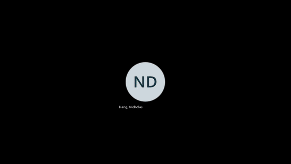

# DWPongUnity
The goal of this project is to reimplementate the game engine component of DWPongDiscoveryWorld inside the Unity game engine instead. This will allow for better maintainability as well as more scalability to add additional features to the game as Unity is a much more popular engine for game development.

## Exhibit Setup

Python 3.8.10 was used to run the AI and depth camera modules

### Install python libraries
```bash
$ cd DWPongUnity\StandaloneAI
$ pip install -r requirements.txt
```
### Install Depth Camera
- [Intel Realsense D435 depth camera](https://www.intelrealsense.com/get-started-depth-camera/)

### Install Mosquitto
- [Mosquitto](https://mosquitto.org/download/)

### Start AI
```bash
$ cd DWPongUnity\StandaloneAI\exhibit
$ python ai\ai_driver.py
```

### Start Depth Camera
```bash
$ cd DWPongUnity\StandaloneAI\exhibit
$ python motion\motion_driver.py
```

### Start Unity Game
```bash
$ cd DWPongUnity\Builds
$ DWPong.exe
```



## Documentation
* [MQTT Overview](docs/mqtt_overview.md)
* [Unity Overview](docs/unity_overview.md)
* [AI & Depth Camera Overview](docs/ai_overview.md)
