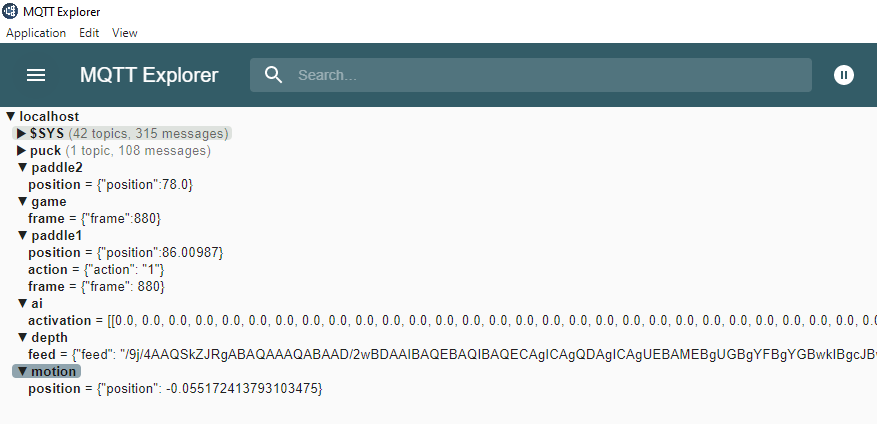

# MQTT Overview

 MQTT and mosquitto will be used for inter-communication within the game. The installation could be found here: [MQTT download](https://mosquitto.org/download/)
 
## MQTT Explorer
MQTT Explorer can be used to view the messages sent through MQTT as the game is running. The application can be downloaded here: [MQTT Explorer](http://mqtt-explorer.com/).

Below contains a snippet of all the messages sent to MQTT for this project.

## Unity to MQTT
This contains the information sent and received from this Unity game repository: [DWPongUnity](https://github.com/dangnicholas/DWPongUnity)

### Publish to MQTT
**Publish gamestate to AI**
- Option 1. Publish gamestate as a snapshot of game as 2d array of 1s and 0s
   - camera/gamestate: 
      1. Publishes a single string of 0s (paddles and ball) and 1s (empty space) with 92160 digits (e.g. "0000011100...")
- Option 2. Publish gamestate of game by paddle positions and ball position (Currently used)
   - paddle1/position
      - The position of the AI paddle as a json (e.g. {"position": 79.997345})
   - puck/position
      - The position of the puck as a json (e.g. {"x": 114.2345435, "y": 75.232})

**Additional game state to AI**
- game/frame
   - Publishes a frame count as a string which is grabbed from Unity's Time.frameCount as a json (e.g. {"frame": 755})
- game/level
   - Publishes a game level as string as a json (e.g. {"level": 2})

### Received from MQTT
- paddle1/action
   1. Receives a number from 0-2 (left, right, do nothing) based on inference as a json (e.g. {"action": 1})
- paddle1/frame
   1. Receives a frame number that the AI did inference on as a json (e.g. {"frame": 755})
- motion/position
   1. Receives a position ranging from -1.15 to 0.15 representing the player position from the depth camera. Used to control bottom paddle as a json (e.g. {"position":  0.7816})

## AI to MQTT
This contains the information sent and received from the Standalone AI scripts here: [StandaloneAI](https://github.com/dangnicholas/DWPongUnity/tree/main/StandaloneAI/exhibit)

### Publish to MQTT
- paddle1/action
   1. Publishes a number from 0-2 (left, right, do nothing) based on inference as a json (e.g. {"action": 1})
- paddle1/frame
   1. Publishes the frame the AI did inference on as a json (e.g. {"frame": 755})
- motion/position
   1. Publishes a position ranging from -1.15 to 0.15 representing the player position from the depth camera. Used to control bottom paddle as a json (e.g. {"position":  0.7816})
        
### Received from MQTT
- Option 1. Publish gamestate as a snapshot of game as 2d array of 1s and 0s
     - camera/gamestate: 
        1. Receives a single string of 0s (paddles and ball) and 1s (empty space) with 92160 digits (e.g. "0000011100...")
        2. String is converted into a 160x192x3 np array for model input
- Option 2. Publish gamestate of game by paddle positions and ball position (Currently used)
   - paddle1/position
      - The position of the AI paddle as a json (e.g. {"position": 79.997345})
   - puck/position
      - The position of the puck as a json (e.g. {"x": 114.2345435, "y": 75.232}) 

**Additional game state received**  
   - game/frame:
      1. Receives a frame count as a string which is grabbed from Unity's Time.frameCount as a json (e.g. {"frame": 755})
   - game/level:
      1. Receives a game level as string as a json to change AI difficulty by switching models (e.g. {"level": 2})
