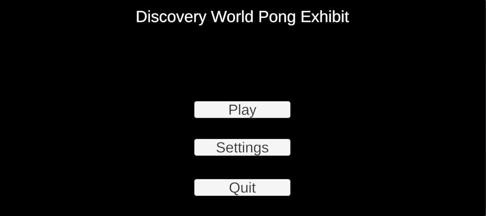
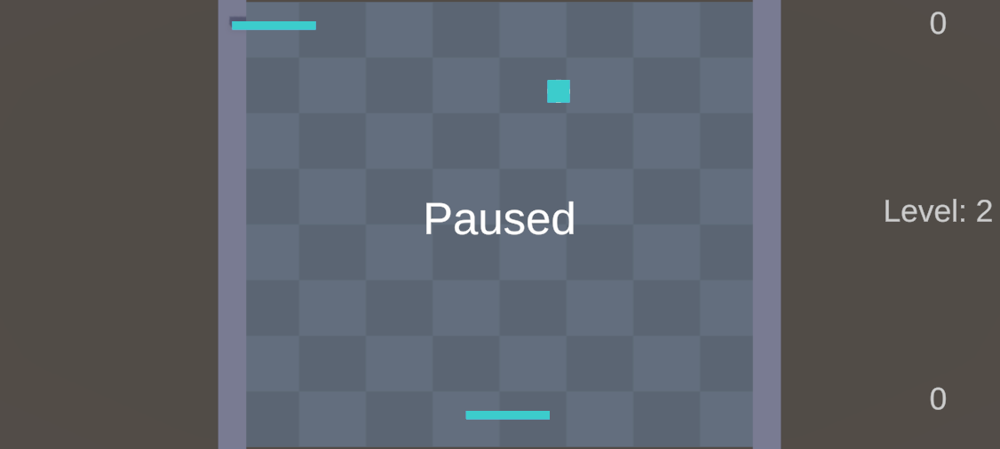
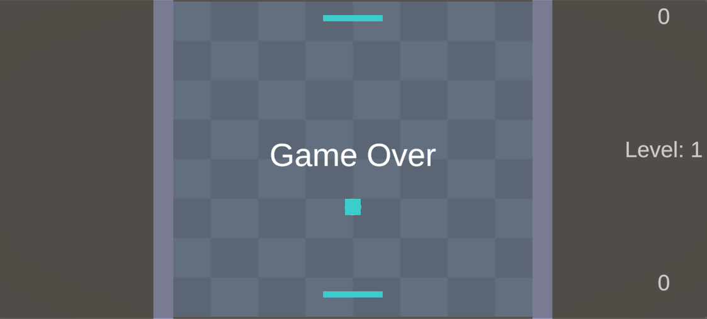
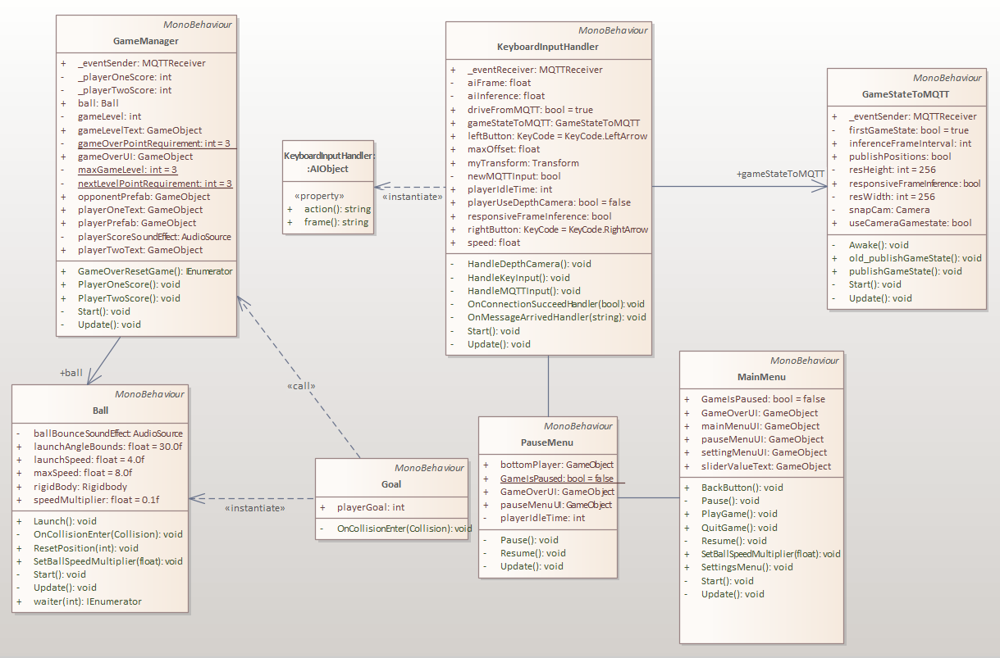

# Unity Overview

This page contains an overview of the Unity pong game implementation found here: [DWPongUnity](https://github.com/dangnicholas/DWPongUnity)

## Game Objects Overview
- **Main Camera**: The camera that the player sees
- **AI Camera**: The camera that is filtered to only see the top paddle and ball
- **Game Manager**: The game object that handles the basic game loop
- **Top Player**: The top paddle that the AI controls
- **Bottom Player**: The bottom paddle that the player controls
- **Ball**: A ball game object that can bounce on the bounds and paddles
- **Bounds**: Contains 4 game objects for each wall of the game
- **Quad**: The floor of the game
- **Canvas**: The canvas used for all the UI implementations

## UI Overview

- Pressing 'M' will open the main menu of the game.

- An idle player will result in the pause menu popping up and pausing the game until the player moves

- A Game Over menu will pop up when the player loses 3 points to the AI

## Adjustable Settings
Some settings can be adjusted in the Unity editor

### Two options of sending game state to AI

**1. Send game state to AI using paddle and ball positions**
- AICamera > Game State To MQTT (Script) > Use Camera Gamestate (unchecked)
- Set self.UNITY_RECV_POSITIONS = True from [configs.py](https://github.com/dangnicholas/DWPongUnity/blob/main/StandaloneAI/exhibit/shared/config.py)

**2. Send game state to AI using snapshot of game and sending 2d array of 1s and 0s**
- AICamera > Game State To MQTT (Script) > Use Camera Gamestate (checked)
- Set self.UNITY_RECV_POSITIONS = False from [configs.py](https://github.com/dangnicholas/DWPongUnity/blob/main/StandaloneAI/exhibit/shared/config.py)

### Two options of AI frame inference intervals

**1. Sending the game state exactly every 5 frames**
- AICamera > Game State To MQTT (Script) > Responsive Frame Inference (unchecked)
- AICamera > Top Player > Responsive Frame Inference (unchecked)

**2. Sending the game state responsively immediately after AI inference**
- AICamera > Game State To MQTT (Script) > Responsive Frame Inference (checked)
- AICamera > Top Player > Responsive Frame Inference (checked)

### Changing the ball settings
- Ball
  - Launch Speed: The initial speed of ball
  - Max Speed: The maximum speed of the ball

### Changing the paddle settings
- (Top/Bottom) Player
   - Speed: The speed of the paddle
   - Max Offset: The max position the AI can move from origin
   - Depth Min Position > The minimum position value (left) from the depth camera
   - Depth Max  Position > The maximum position value (right) from the depth camera

## UML Diagram

Below is an UML Diagram of the Scripts created. There are a total of 7 scritps found in the Assets/Scripts folder

